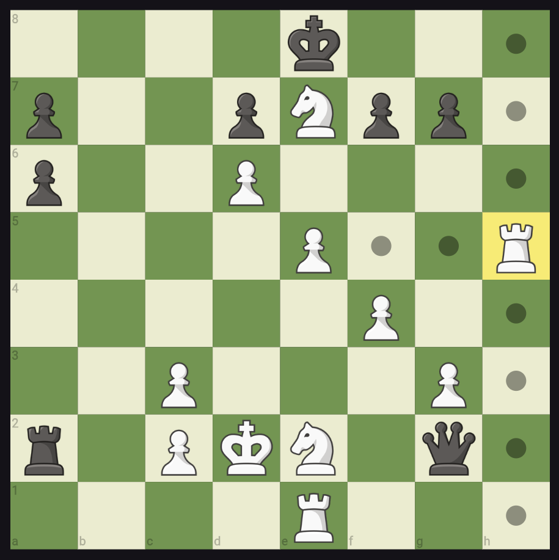
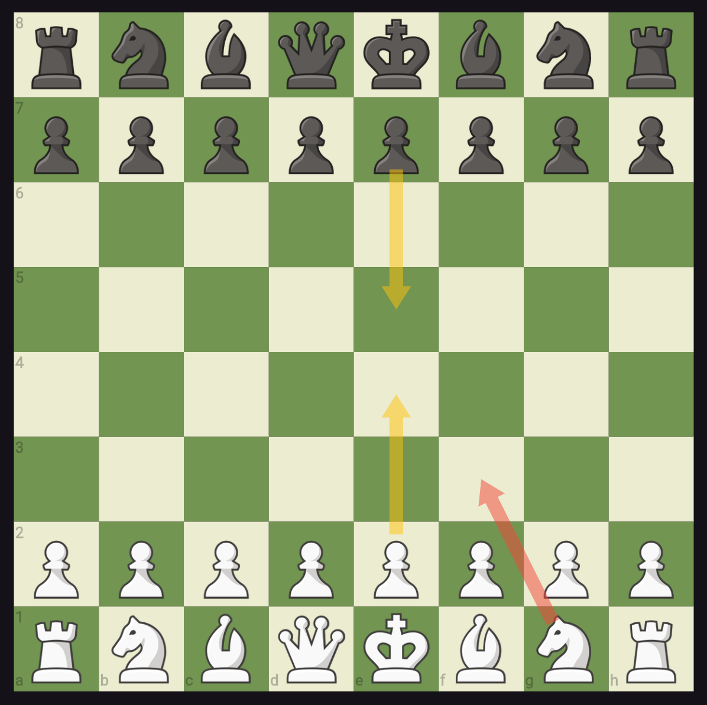

# advanced_chess_board

It's a chess board developed in using plain flutter widgets without using images of a board. So you can customize board color as per your need. It uses a `ChessBoardController` to control the board state. 




## Features

- You can load the board with custom FEN.
- Control the orientation of the board.
- Enable/Disable moves on board.
- Move the pieces either by clicking/tapping or dragging.
- Highlight the valid moves upon clicking/tapping or dragging.
- Draw arrows on the board
- Make a move using the controller programmatically.
- Get the move history, playerToMove, isCheckmate, undo move etc.
- Add a listener using the controller.
- Controller also exposes the game object to control the board further.

## Getting started

- Add a dependency to this package (advanced_chess_board) in your pubspec.yaml
- Add an `AdvancedChessBoard` widget and provide a `ChessBoardController` object to it.
- Optional : If you to provide custom colors for board you can provide corresponding `darkSquareColor` and `lightSquareColor` parameters.
- Optional : By default board orientation is for white. You can provide optional `boardOrientation` to be either black or white.

## Usage

Below is the basic example with minimal parameters.
See the example/main.dart for more details. 

```dart
  @override
  Widget build(BuildContext context) {
    return MaterialApp(
      title: 'Chess Board Example',
      debugShowCheckedModeBanner: false,
      theme: ThemeData(
        primarySwatch: Colors.blue,
      ),
      darkTheme: ThemeData(brightness: Brightness.dark, useMaterial3: true),
      themeMode: ThemeMode.dark,
      home: Scaffold(
        appBar: AppBar(title: const Text('Chess Board Example')),
        body: Center(
          child: AdvancedChessBoard(
            controller: controller,
          ),
        ),
      ),
    );
  }
```

## Credits

For the images of pieces, it currently uses the images of Chess.com.

## Additional information

Support for drawing arrow will be added in upcoming release.
